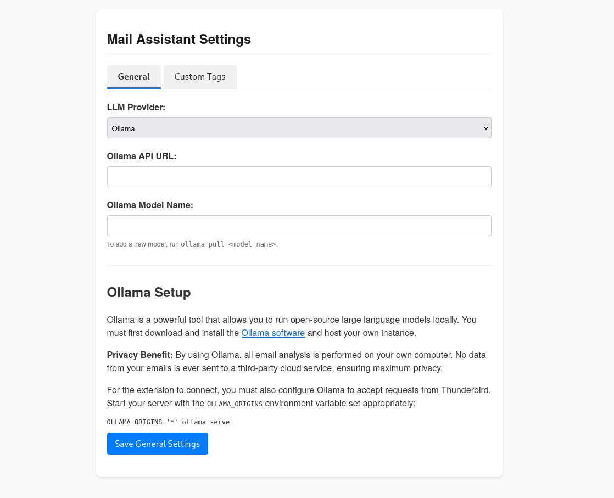
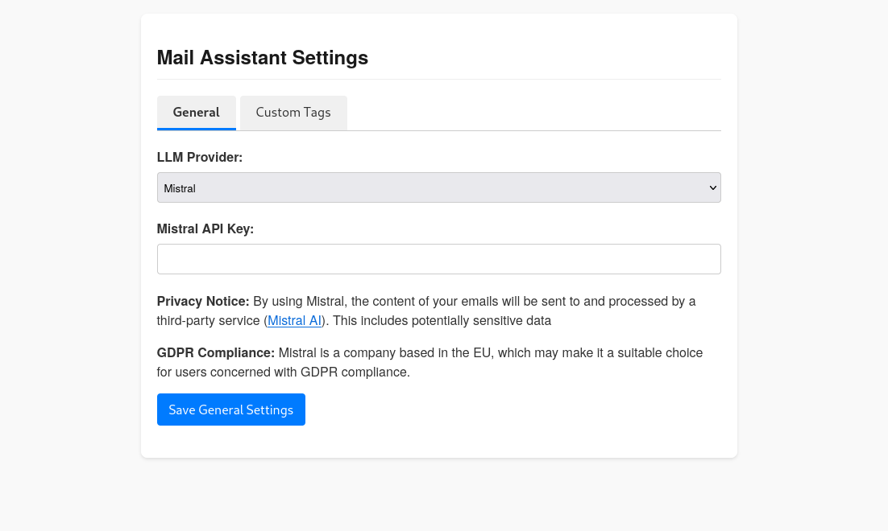
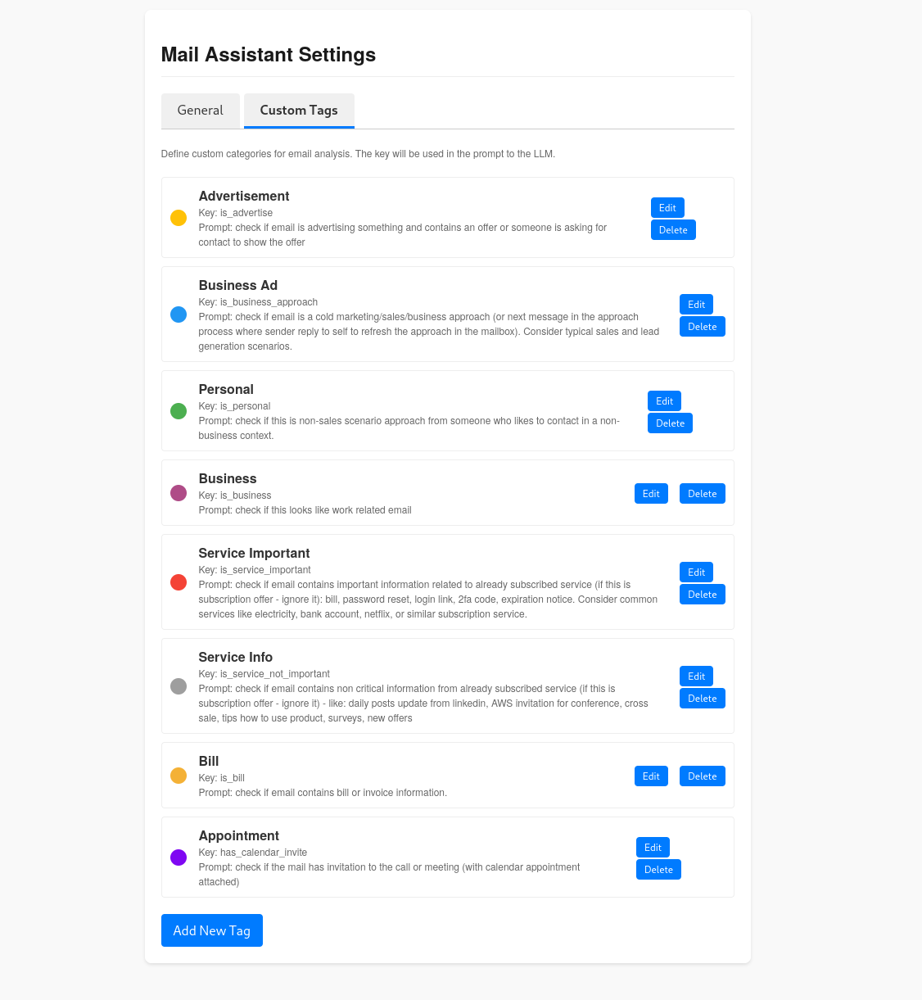
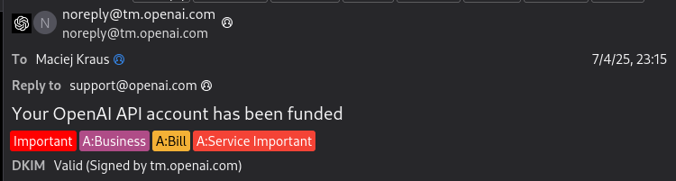

# Thunderbird Email AI Assistant
> AI-powered, multi-provider mail tagging and classification engine for Thunderbird.

Plugin page: https://addons.thunderbird.net/eN-US/thunderbird/addon/email-assistant/

This Thunderbird MailExtension provides a powerful and flexible framework for AI-powered email analysis. It automatically processes incoming emails, sends them to a language model of your choice for analysis, and then applies tags based on the model's response. This allows for sophisticated, automated email classification and sorting.

## Key Features

- **Multi-Provider LLM Support**: Integrates with local models via Ollama and cloud-based models from OpenAI, Google Gemini, Anthropic Claude, Mistral, and DeepSeek.
- **Dynamic Email Analysis**: Intelligently extracts headers, text content (converting HTML to plain text), and attachment details for efficient and accurate analysis by the LLM.
- **Fully Configurable Tagging**: Allows users to define their own custom tags, colors, and LLM prompts for a completely personalized email classification system.
- **Privacy-Focused**: Gives users the choice between maximum privacy with a local Ollama instance or the power of cloud-based models, with clear privacy notices for each.
- **Secure Configuration**: Features a comprehensive options page for managing API keys and provider settings, using Thunderbird's runtime permissions API for security.

## Configuration and Usage

After installing the add-on, you can configure it by going to `Tools > Add-ons and Themes`, finding "Mail Assistant", and clicking the "..." button to select **Options**.

### General Settings

The General tab allows you to select your preferred LLM provider and enter the necessary credentials (API Key or local URL).


*Ollama provider settings, with fields for a local URL and model name.*


*Settings for a cloud provider like Mistral, requiring an API key.*

### Custom Tags

The Custom Tags tab is where you can define the categories for email analysis. You can add, edit, or delete tags. Each tag has a name, a unique key, a color, and a specific prompt instruction that tells the LLM what to check for.


*The interface for managing custom tags.*

### Usage

Once configured, the extension will automatically process new incoming emails. It applies the tags generated by the AI analysis, which can then be used with Thunderbird's built-in Message Filters to organize your inbox.

### Organizing emails

Once automated tagging is working, you may create filters that will move tagged messages to folders or take other actions. You should set those filters to run
periodically, as tagging is executed after initial filtering. 



*An example of an email that has been automatically tagged by the assistant.*

## Development

### Prerequisites

- **Node.js and npm**: Required for managing dependencies and running build scripts. You can download them from [nodejs.org](https://nodejs.org/).
- **Thunderbird**: The application this extension is built for.

### Build Instructions

1.  **Clone the repository:**
    ```bash
    git clone https://github.com/mcj-kr/thunderbird-email-ai-assistant.git
    cd thunderbird-email-ai-assistant
    ```

2.  **Install dependencies:**
    ```bash
    npm install
    ```

3.  **Build the extension:**
    This command runs webpack to bundle the scripts and then uses `web-ext` to package everything into a `.zip` file located in the `web-ext-artifacts/` directory.
    ```bash
    ./build.bash
    ```

## Installation                                                                                                                                                                                     
### Adding plugin
Install plugin from: https://addons.thunderbird.net/eN-US/thunderbird/addon/email-assistant/

### Temporary Installation (for Development)                                                                                                                                                        

1.  Build the extension using the instructions above.                                                                                                                                           
2.  In Thunderbird, go to `Tools > Add-ons and Themes`.                                                                                                                                             
3.  Click the gear icon, select `Debug Add-ons`, and then click `Load Temporary Add-on...`.                                                                                                         
4.  Select the generated `.zip` file from the `web-ext-artifacts/` directory.                   
